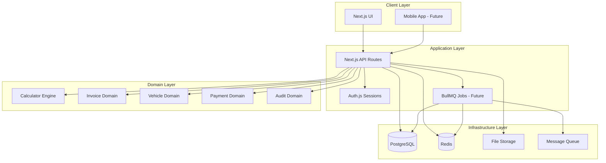
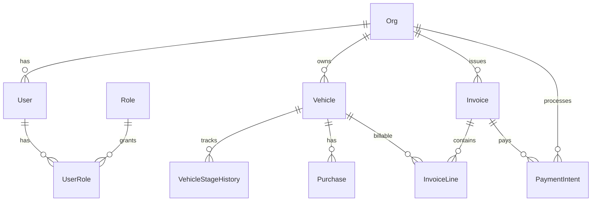
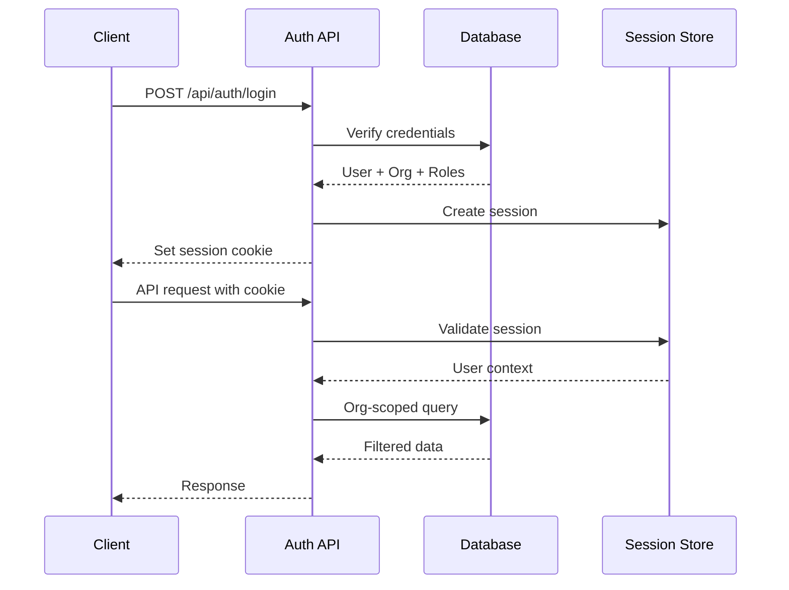

# United Cars Architecture

## Overview

United Cars is built as a **modular monolith** with clean domain boundaries, enabling future microservices migration while maintaining development velocity and operational simplicity in the current phase.

## System Architecture



## Domain Boundaries

### 1. **Identity & Access (IAM)**
- Users, Organizations, Roles
- Authentication & Authorization
- Multi-tenant data isolation

### 2. **Vehicle Management**
- Vehicle lifecycle tracking
- Stage history and status
- VIN management and validation

### 3. **Financial Management**
- Invoice generation and management
- Payment intent workflows
- Chart of accounts and journaling

### 4. **Calculation Engine**
- Pure calculation functions
- Versioned input/output schemas
- Auction, towing, shipping, customs

### 5. **Logistics & Operations**
- Title management
- Package tracking
- Service requests

### 6. **Pricing & Configuration**
- Fee matrices management
- Rule-based pricing
- Admin configuration

### 7. **Audit & Compliance**
- Change tracking
- User activity logging
- Data lineage

## Data Architecture

### Database Design



### Key Design Principles

1. **Org-Scoped Isolation** - All data belongs to an organization
2. **Immutable History** - Stage changes create new history records
3. **Event Sourcing Ready** - Current state + history events
4. **Audit Trail** - Every mutation logged with context
5. **Type Safety** - Prisma generates type-safe client

## Technology Stack

### Core Technologies

| Layer | Technology | Purpose |
|-------|------------|---------|
| **Frontend** | Next.js 14 + TypeScript | React app with SSR/SSG |
| **Backend** | Next.js API Routes | RESTful API endpoints |
| **Database** | PostgreSQL + Prisma | Primary data store |
| **Cache** | Redis | Session storage, future queues |
| **Auth** | Auth.js (NextAuth) | Session management |
| **Validation** | Zod | End-to-end type safety |
| **Styling** | Tailwind CSS + shadcn/ui | Consistent design system |
| **State** | Zustand + TanStack Query | Client state + server sync |

### Architecture Decisions

#### Why Modular Monolith?
- **Current Phase**: Single team, rapid iteration
- **Operational Simplicity**: One deployment, easier debugging
- **Domain Clarity**: Clean boundaries prepare for future split
- **Performance**: No network latency between domains

#### Why Next.js Full-Stack?
- **Developer Experience**: Single framework, shared types
- **Performance**: Server components, edge computing
- **Deployment**: Vercel-optimized, edge functions
- **Ecosystem**: Rich component libraries, tooling

#### Why Prisma?
- **Type Safety**: Generated client prevents runtime errors
- **Migration Management**: Version-controlled schema changes
- **Developer Experience**: Excellent VS Code integration
- **Performance**: Query optimization, connection pooling

## Security Architecture

### Authentication Flow



### Security Layers

1. **Input Validation** - Zod schemas on all endpoints
2. **Authentication** - Session-based auth with secure cookies
3. **Authorization** - Role-based access control (RBAC)
4. **Data Isolation** - Org-scoped database queries
5. **Audit Logging** - All mutations tracked
6. **Rate Limiting** - API endpoint protection
7. **CSRF Protection** - Built-in Next.js protection

## Deployment Architecture

### Development Environment

```yaml
services:
  postgres:    # Database with sample data
  redis:       # Session store + future queues
  web:         # Next.js app with hot reload
```

### Production Environment

```yaml
services:
  postgres:    # Managed database (RDS/Neon)
  redis:       # Managed cache (ElastiCache/Upstash)
  web:         # Container orchestration (ECS/Kubernetes)
  cdn:         # Static assets (CloudFront/Cloudflare)
  monitoring:  # Observability (DataDog/New Relic)
```

## Performance Considerations

### Database Optimization
- **Indexing Strategy** - Org-scoped queries, common filters
- **Connection Pooling** - Prisma connection management
- **Query Optimization** - N+1 prevention, eager loading
- **Read Replicas** - Future scaling for read-heavy workloads

### Caching Strategy
- **Application Cache** - TanStack Query for client-side
- **Session Cache** - Redis for authentication
- **Static Assets** - CDN for images and documents
- **API Cache** - Future Redis cache for expensive calculations

### Monitoring & Observability

```typescript
// Request correlation
app.use((req, res, next) => {
  req.correlationId = generateId()
  logger.child({ correlationId: req.correlationId })
  next()
})

// Performance tracking
app.use((req, res, next) => {
  const start = Date.now()
  res.on('finish', () => {
    const duration = Date.now() - start
    metrics.histogram('http_request_duration', duration, {
      method: req.method,
      route: req.route?.path,
      status: res.statusCode
    })
  })
  next()
})
```

## Future Architecture Evolution

### Phase 1: Current (Monolith)
- Single Next.js application
- PostgreSQL + Redis
- Direct function calls between domains

### Phase 2: Service Extraction
- Extract calculation engine as microservice
- Extract file processing service
- Add message queue for async processing

### Phase 3: Event-Driven
- Domain events for loose coupling
- Event sourcing for audit and replay
- CQRS for read/write separation

### Phase 4: Distributed
- Full microservices architecture
- API gateway and service mesh
- Distributed tracing and monitoring

## Development Guidelines

### Package Organization
```
packages/
  db/          # Database schema and migrations
  core/        # Shared types and utilities
  calc/        # Pure calculation functions
  ui/          # Reusable UI components
  jobs/        # Background job processors
  pdf/         # Document generation
```

### API Design Principles
1. **RESTful Resources** - Standard HTTP verbs and status codes
2. **Consistent Responses** - Uniform error and success formats
3. **Input Validation** - Zod schemas for all inputs
4. **Error Handling** - Proper error types and messages
5. **Documentation** - OpenAPI specs for all endpoints

### Testing Strategy
1. **Unit Tests** - Pure functions (calculators, utilities)
2. **Integration Tests** - API endpoints with database
3. **E2E Tests** - Critical user workflows
4. **Performance Tests** - Load testing for scalability

This architecture provides a solid foundation for current needs while maintaining flexibility for future growth and evolution.