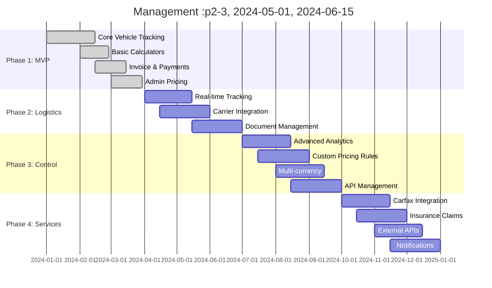

# United Cars Roadmap

## Vision
Build the most comprehensive and user-friendly vehicle auction management platform that scales from individual dealers to enterprise operations.

## Roadmap Overview

---

## Phase 1: MVP Foundation ✅
**Timeline**: Q1 2024 | **Status**: Completed

Build core functionality to validate the business model and gather user feedback.

### ✅ Completed Features

#### Authentication & Access Control
- [x] Multi-tenant organization system
- [x] Role-based access control (RBAC)
- [x] User management with org scoping
- [x] Session-based authentication

#### Vehicle Management
- [x] Vehicle lifecycle tracking
- [x] VIN management and validation
- [x] Stage history with timestamps
- [x] Status updates and notifications

#### Cost Calculators
- [x] Auction fee calculator (COPART/IAA)
- [x] Towing cost calculator with routes
- [x] Shipping cost calculator
- [x] Customs duty calculator
- [x] Pure functions with versioning

#### Financial Management
- [x] Invoice generation with line items
- [x] Payment intent workflow
- [x] PDF invoice export
- [x] Basic accounting (chart of accounts)

#### Admin & Configuration
- [x] Fee matrix management
- [x] Pricing rule configuration
- [x] General fee management
- [x] Audit logging system

### Key Metrics Achieved
- **Login Success**: ✅ Works with demo credentials
- **Calculator Accuracy**: ✅ Realistic fee calculations
- **Invoice Generation**: ✅ Professional PDF output
- **Payment Workflow**: ✅ Submit → Confirm → Track
- **Admin Controls**: ✅ Live pricing updates

---

## Phase 2: Logistics & Operations 🚧
**Timeline**: Q2 2024 | **Status**: Planning

Enhance operational efficiency with real-time tracking and automation.

### 🎯 Planned Features

#### Real-time Vehicle Tracking
- [ ] GPS integration for vehicles in transit
- [ ] Milestone notifications (pickup, delivery, etc.)
- [ ] ETA calculations based on traffic
- [ ] Customer portal for tracking

#### Carrier & Logistics Integration
- [ ] API integration with major carriers
- [ ] Automated booking and scheduling
- [ ] Rate comparison engine
- [ ] Carrier performance tracking

#### Title Management Workflow
- [ ] Title status tracking (pending → received → sent)
- [ ] Package management with tracking numbers
- [ ] OCR for title document processing
- [ ] Automated title forwarding

#### Document Management System
- [ ] File upload with S3 storage
- [ ] Document categorization and tagging
- [ ] Version control for documents
- [ ] Digital signatures for contracts

### Success Criteria
- [ ] 90% reduction in manual tracking calls
- [ ] 50% faster title processing times
- [ ] 95% accurate ETA predictions
- [ ] 100% document digitization

---

## Phase 3: Control & Intelligence 📊
**Timeline**: Q3 2024 | **Status**: Planned

Add sophisticated analytics, reporting, and business intelligence.

### 🔮 Planned Features

#### Advanced Analytics Dashboard
- [ ] Interactive charts and visualizations
- [ ] Custom report builder
- [ ] KPI tracking and alerts
- [ ] Cohort analysis and trends

#### Custom Pricing Rules Engine
- [ ] Visual rule builder interface
- [ ] A/B testing for pricing strategies
- [ ] Market-based dynamic pricing
- [ ] Profit margin optimization

#### Multi-currency Support
- [ ] Real-time exchange rates
- [ ] Multi-currency invoicing
- [ ] Hedging and risk management
- [ ] Regional pricing variations

#### API Management Platform
- [ ] Developer portal with documentation
- [ ] API key management and quotas
- [ ] Rate limiting and throttling
- [ ] Usage analytics and billing

### Success Criteria
- [ ] 30% improvement in profit margins
- [ ] 50% reduction in pricing errors
- [ ] 100% API uptime SLA
- [ ] 25% increase in operational efficiency

---

## Phase 4: Services & Integration 🔌
**Timeline**: Q4 2024 | **Status**: Planned

Integrate with external services and provide comprehensive vehicle history.

### 🌐 Planned Features

#### Carfax & Vehicle History
- [ ] Automated Carfax report ordering
- [ ] Vehicle history integration
- [ ] Damage assessment tools
- [ ] Market value predictions

#### Insurance Claims Management
- [ ] Claims workflow automation
- [ ] Photo documentation system
- [ ] Adjuster coordination tools
- [ ] Settlement tracking

#### External API Integrations
- [ ] Auction house APIs (COPART, IAA)
- [ ] Banking and payment processors
- [ ] Shipping line APIs
- [ ] Government customs systems

#### Automated Notifications
- [ ] Smart notification engine
- [ ] Multi-channel delivery (email, SMS, push)
- [ ] Customizable alert rules
- [ ] Escalation workflows

### Success Criteria
- [ ] 90% automated Carfax processing
- [ ] 75% faster claims resolution
- [ ] 99.9% external API reliability
- [ ] 95% notification delivery success

---

## Phase 5: Scale & Performance 🚀
**Timeline**: Q1 2025 | **Status**: Future

Prepare for enterprise scale and international expansion.

### 🌍 Planned Features

#### Microservices Migration
- [ ] Extract calculation engine service
- [ ] Separate file processing service
- [ ] Independent notification service
- [ ] API gateway implementation

#### Event-Driven Architecture
- [ ] Domain events for loose coupling
- [ ] Event sourcing for audit trails
- [ ] CQRS for read/write optimization
- [ ] Message queue processing

#### International Expansion
- [ ] Multi-language support (i18n)
- [ ] Regional compliance features
- [ ] Local payment methods
- [ ] Currency hedging tools

#### Enterprise Features
- [ ] White-label solutions
- [ ] Advanced user management
- [ ] Custom integrations
- [ ] SLA guarantees

### Success Criteria
- [ ] Support 10,000+ concurrent users
- [ ] 99.99% uptime guarantee
- [ ] < 100ms API response times
- [ ] International market entry

---

## Success Metrics by Phase

| Phase | Users | Vehicles/Month | Revenue Impact | Performance |
|-------|-------|----------------|----------------|-------------|
| **Phase 1** | 50-100 | 500 | Validation | Basic |
| **Phase 2** | 100-500 | 2,000 | 2x efficiency | Good |
| **Phase 3** | 500-2,000 | 10,000 | 5x profit | Optimized |
| **Phase 4** | 2,000-10,000 | 50,000 | 10x scale | Enterprise |
| **Phase 5** | 10,000+ | 200,000+ | Global | Hyper-scale |

## Risk Mitigation

### Technical Risks
- **Scalability**: Modular architecture enables gradual migration
- **Data Loss**: Comprehensive backup and audit trails
- **Security**: Multi-layer security with regular audits
- **Dependencies**: Minimal external dependencies, fallback options

### Business Risks
- **Market Changes**: Flexible pricing and feature toggles
- **Competition**: Rapid iteration and customer feedback loops
- **Regulations**: Compliance-first approach with legal review
- **Integration Failures**: Robust error handling and monitoring

## Feedback Loops

### User Research
- Monthly user interviews and surveys
- Usage analytics and behavior tracking
- Customer support ticket analysis
- Feature request prioritization

### Technical Metrics
- Performance monitoring and alerting
- Error rate tracking and resolution
- Code quality metrics and reviews
- Security vulnerability scanning

### Business Intelligence
- Revenue and profit tracking
- Customer acquisition and retention
- Market penetration analysis
- Competitive positioning assessment

---

**Last Updated**: January 2024  
**Next Review**: Quarterly roadmap review  
**Contact**: Product Team